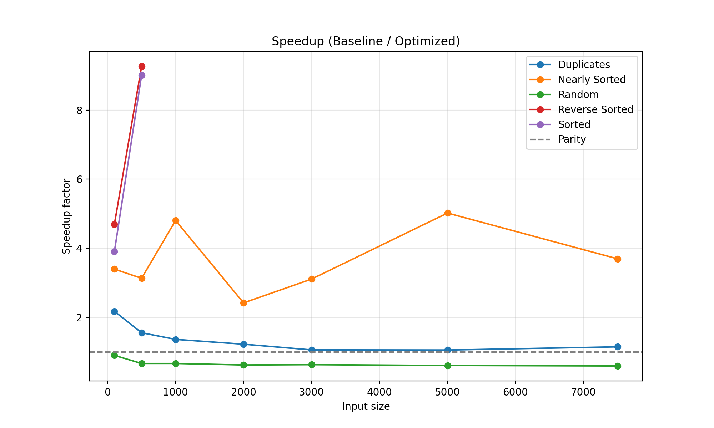
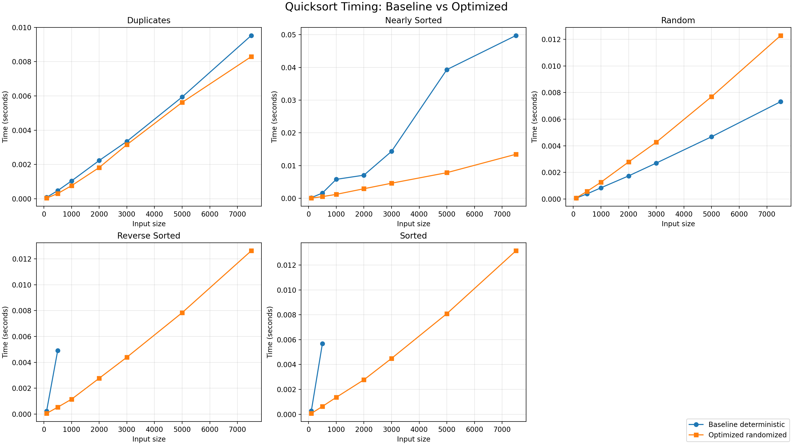

# Results

This page collects the benchmark outputs, result plots, and report documents in one place.

## Summary

- The optimized quicksort improves worst-case behavior on nearly sorted, reverse sorted, and sorted inputs.
- For random input, timings indicate overhead from pivot randomization compared to the deterministic baseline.
- Detailed measurements are available in the CSV dataset below.

## Raw Data

- Benchmark CSV: [results/raw_data/benchmark_results.csv](results/raw_data/benchmark_results.csv)

## Plots

### Speedup (Baseline / Optimized)



Source file: [results/plots/speedup_summary.png](results/plots/speedup_summary.png)

### Timing Curves by Distribution



Source file: [results/plots/timings_by_distribution.png](results/plots/timings_by_distribution.png)

## Reports

- Main report (Word): [report/Part1_Optimization_Technique_Project_Report.docx](report/Part1_Optimization_Technique_Project_Report.docx)
- Source code and screenshots (Word): [report/Part1_Source_Code_and_Screenshots.docx](report/Part1_Source_Code_and_Screenshots.docx)
- Part 2 presentation (PowerPoint): [Part2_Elementary_Data_Structures_Presentation.pptx](Part2_Elementary_Data_Structures_Presentation.pptx)

## Regeneration

Run these commands from the project root to regenerate data and figures:

```bash
PYTHONPATH=. python experiments/run_benchmarks.py
python experiments/plot_results.py
```
